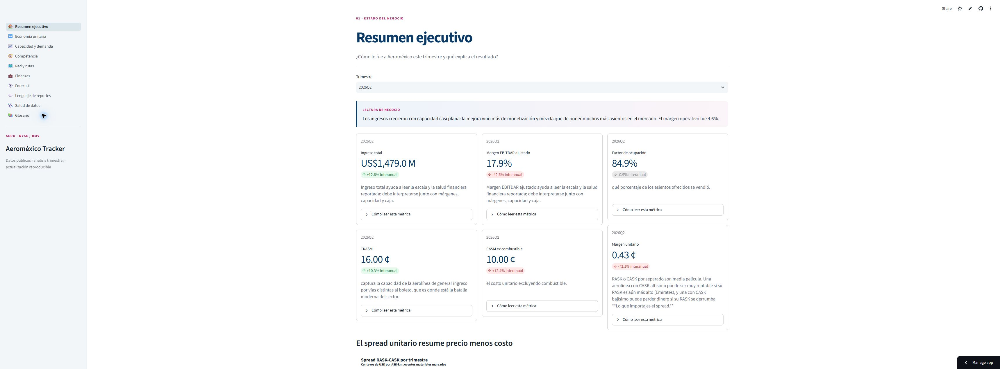
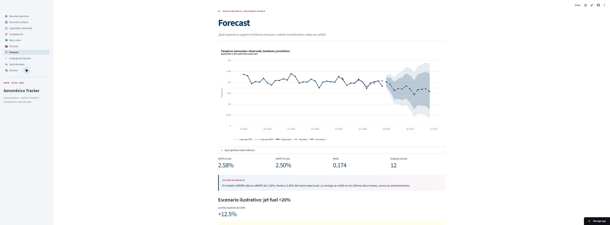

# Aeroméxico Tracker

Sistema reproducible de ingesta, consolidación, análisis y visualización de información pública de **Grupo Aeroméxico S.A.B. de C.V.** (`AERO`, NYSE/BMV; CIK SEC `0001561861`).

El proyecto transforma fuentes regulatorias, operativas y de mercado en una lectura trimestral de negocio. Conserva los datos crudos con hash, separa cifras reportadas de derivadas, explicita faltantes y nunca rellena una ausencia como cero. Es un proyecto independiente de portafolio; **no es oficial ni constituye consejo de inversión**.

## Dashboard

La candidata local de la Etapa 10 tiene once vistas: resumen, economía unitaria, capacidad y demanda, competencia, red y rutas, finanzas, forecast, lenguaje de reportes, salud de datos, estructura de datos y glosario. La publicación vigente conserva diez vistas hasta recibir aprobación visual explícita para incorporar la nueva página.

[Repositorio público en GitHub](https://github.com/salvamalfa/aeromexico-tracker)

[](https://aeromexico-tracker-djwjbylohwdryhbvnjhwsy.streamlit.app/)

**Dashboard público:** [aeromexico-tracker-djwjbylohwdryhbvnjhwsy.streamlit.app](https://aeromexico-tracker-djwjbylohwdryhbvnjhwsy.streamlit.app/)

Los valores exactos del despliegue y su validación están en [la guía de publicación](docs/deploy-streamlit.md). La aplicación corre con Python **3.13** y no utiliza secretos.





Para recorrer el argumento completo, consulta [el recorrido narrado](docs/dashboard-recorrido.md).

## Estado

Las **Etapas 0 a 9 están completas**. La **Etapa 10 está implementada y validada localmente**, pendiente únicamente de aprobación visual, publicación y comprobación del enlace profundo público.

- 31 tablas Gold y 28 datasets Silver validados por contrato.
- 186 pruebas automatizadas.
- 15/15 controles específicos de la página `Estructura de datos`.
- 18/18 controles específicos del dashboard.
- 11/11 vistas locales ejecutadas sin excepciones; la candidata se verificó en escritorio, 736 px, 360 px y temas claro/oscuro.
- La versión pública previa mantiene 10/10 vistas verificadas, incluido el enlace profundo `/forecast`.
- Carga local de 0.20–0.48 s por vista; rerun de 0.008–0.085 s en el entorno de aceptación actual.
- Operación offline: el dashboard solo lee Parquet local mediante DuckDB en memoria.

## Hallazgos principales

- Aeroméxico cerró `2026Q2` con ingreso total de **US$1,479 millones**, margen EBITDAR ajustado de **17.9%**, factor de ocupación de **84.9%** y spread unitario RASK−CASK de **0.43 centavos por ASK-km**.
- Entre `2026Q1` y `2026Q2`, el spread cayó **0.68 centavos**: precio aportó `+0.25`, combustible `−1.04` y el residual estructural `+0.11`; FX no pudo aislarse y no se estimó.
- En junio de 2026, la participación total AFAC fue **19.1%** para Aeroméxico frente a **26.2%** para Volaris.
- El forecast SARIMA publicado superó al naive estacional: sMAPE de test **2.50%** frente a **3.36%**, con bandas de 80% y 95% siempre visibles.
- Hay **23 anomalías** abiertas para investigación. No se presentan como errores confirmados.

## Ejecutar localmente

Requisitos: Git, `uv` y `just`.

```powershell
Copy-Item .env.example .env
# Completar SEC_USER_AGENT con un correo real y monitoreado.
just setup
just test
just dashboard
```

La app abre en `http://localhost:8501`. No necesita internet para consultar las tablas ya construidas.

| Comando | Propósito |
|---|---|
| `just setup` | Instala el entorno bloqueado y Chromium. |
| `just ingest` | Ejecuta las ingestas registradas que usan red. |
| `just parse` | Reconstruye silver desde bronze inmutable. |
| `just transform` | Construye gold desde silver. |
| `just rebuild` | Reconstrucción completa offline desde bronze. |
| `just test` | Ejecuta la suite. |
| `just dashboard` | Inicia Streamlit con el entrypoint estable. |
| `just dashboard-validate` | Ejecuta los 15 controles de Etapa 10 y los 18 controles de regresión del dashboard. |

## Arquitectura

```text
fuentes públicas
      │
      ▼
data/bronze/     descargas inmutables + SHA-256; no se versionan
      │
      ▼
data/silver/     tablas fieles a cada fuente; no se versionan
      │
      ▼
data/gold/       31 Parquet consolidados y versionados
      │
      ├── data/warehouse.duckdb   vistas analíticas locales
      ├── src/analytics/          estudios y modelos precomputados
      └── src/dashboard/          Streamlit + Plotly + ECharts
```

Las tablas gold sí se versionan porque son los extractos públicos y compactos que consume el deploy. Bronze y silver siguen fuera de Git. Los hashes, URL y metadata de cada descarga viven en `data/bronze/_manifest.jsonl`; los cambios de contenido se registran en `_restatements.jsonl`.

## Datos y documentación

- [Diccionario de tablas y columnas](docs/diccionario-datos.md)
- [Diccionario de conceptos XBRL](docs/diccionario-conceptos-xbrl.md)
- [Hallazgos analíticos](docs/analytics/hallazgos.md)
- [Reportes de cierre por etapa](docs/etapas/)
- [Plan y criterios](docs/plan/README.md)

Fuentes principales: SEC EDGAR, BMV XBRL, AFAC, BTS T-100, Banxico, EIA, datos públicos de mercado, reportes de aerolíneas, grupos aeroportuarios y fuentes regulatorias abiertas. Las limitaciones y bloqueos de cada fuente están documentados en los reportes de etapa.

## Actualización

`.github/workflows/refresh.yml` se ejecuta trimestralmente y también de forma manual. Valida contratos, pruebas y aceptación antes de permitir un commit de gold; si algo falla abre un issue y no publica cambios. También revisa la fecha de AFAC y abre un recordatorio cuando la fuente manual rebasa 62 días.

Por la decisión explícita de **no versionar bronze**, una reconstrucción con nuevas descargas sigue ejecutándose localmente, donde existen los crudos. El workflow remoto valida y publica gold ya reconstruido; no finge poder recrear fuentes manuales ausentes.
