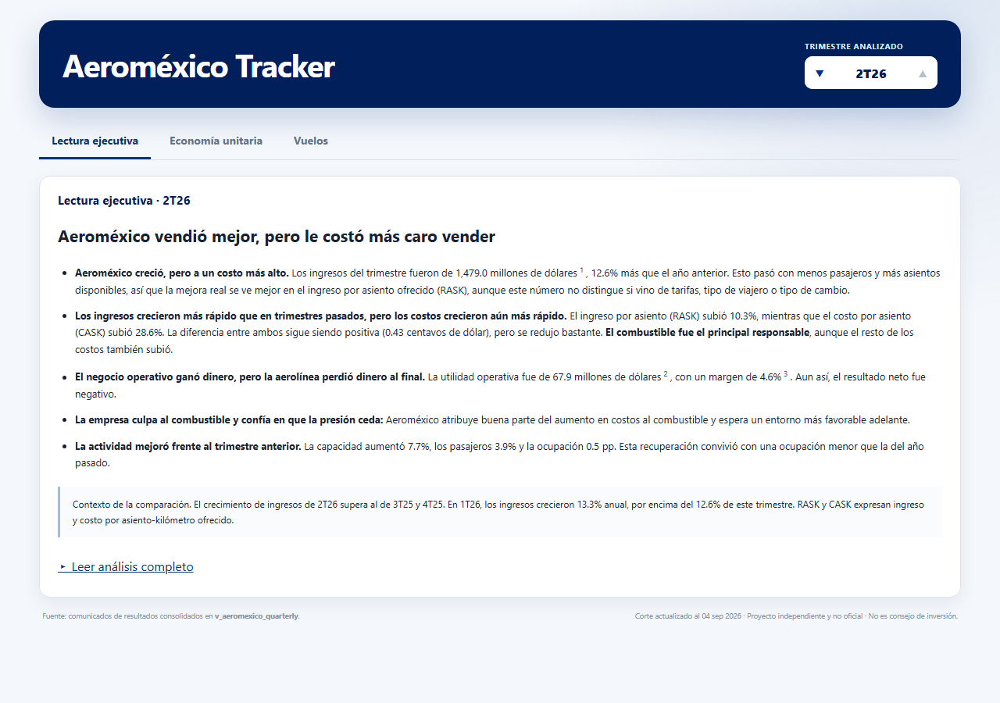

# Aeroméxico Tracker

Sistema reproducible de ingesta, consolidación, análisis y visualización de información pública de **Grupo Aeroméxico S.A.B. de C.V.** (`AERO`, NYSE/BMV; CIK SEC `0001561861`).

El proyecto transforma fuentes regulatorias, operativas y de mercado en una lectura trimestral de negocio. Conserva los datos crudos con hash, separa cifras reportadas de derivadas, explicita faltantes y nunca rellena una ausencia como cero. Es un proyecto independiente de portafolio; **no es oficial ni constituye consejo de inversión**.

## Dashboard

El dashboard publicado presenta tres vistas integradas: Lectura ejecutiva, Economía unitaria y Vuelos, construidas como una página real en `web/` (Vite + TypeScript) y servidas por GitHub Pages. Streamlit se retiró en P7 (ver `docs/arquitectura/migracion-estado.md`); el último commit de `master` con la app Streamlit y la ruta HTML heredada es `e645d3e`.

[Repositorio público en GitHub](https://github.com/salvamalfa/aeromexico-tracker)

**Dashboard público:** <https://salvamalfa.github.io/aeromexico-tracker/>

Publicar una nueva versión requiere una instrucción explícita del dueño:

```
uv run python -m src.publish --record analysis_runs/drafts/<periodo>/<version>.json --out site/
uv run python -m src.publish.verify site/
```

Ver `src/publish/README.md` y `REPO_MAP.md` ("Publicación en GitHub Pages") para el flujo completo. La aplicación corre con Python **3.13** y no utiliza secretos.

Para trabajar desde un clon local o con agentes de nube, consulta
[`AGENTS.md`](AGENTS.md) y la [guía de desarrollo desde GitHub](docs/cloud-development.md).



Para recorrer el argumento completo, consulta [el recorrido narrado](docs/dashboard-recorrido.md).

## Estado

**Analysis Agent:** Etapas 12–14 aceptadas. La [Etapa 15](docs/etapas/etapa-15-reporte.md)
está implementada y pendiente de revisión humana: [cálculos, puentes y fuentes](prototypes/etapa-15/quantitative_review.html).
El motor utiliza evidencia congelada de 2T26 y conserva las diferencias de alcance pendientes.
Todavía no se redactan ni publican análisis trimestrales.

Las **Etapas 0 a 10 están completas**. La página `Estructura de datos` de la app Streamlit heredada fue aprobada visualmente, publicada y comprobada mediante su enlace profundo público en su momento; la app Streamlit se retiró en P7 (ver `docs/arquitectura/migracion-estado.md`), así que hoy solo queda como referencia histórica.

Conteos de tablas Gold y pruebas cambian con cada etapa; la cuenta vigente y
el comando para reproducirla están en [`REPO_MAP.md`](REPO_MAP.md), no aquí.

- Operación offline: el dashboard solo lee Parquet local mediante DuckDB en memoria.

## Hallazgos principales

- Aeroméxico cerró `2026Q2` con ingreso total de **US$1,479 millones**, margen EBITDAR ajustado de **17.9%**, factor de ocupación de **84.9%** y spread unitario RASK−CASK de **0.43 centavos por ASK-km**.
- Entre `2026Q1` y `2026Q2`, el spread cayó **0.68 centavos**: precio aportó `+0.25`, combustible `−1.04` y el residual estructural `+0.11`; FX no pudo aislarse y no se estimó.
- En junio de 2026, la participación total AFAC fue **19.1%** para Aeroméxico frente a **26.2%** para Volaris.
- El forecast SARIMA publicado superó al naive estacional: sMAPE de test **2.50%** frente a **3.36%**, con bandas de 80% y 95% siempre visibles.
- Hay **23 anomalías** abiertas para investigación. No se presentan como errores confirmados.

## Ejecutar localmente

Requisitos: Git, `uv` y `just`.

```powershell
Copy-Item .env.example .env
# Completar SEC_USER_AGENT con un correo real y monitoreado.
just setup
just test
uv run python -m src.web_export --out web/public/data/v1 --allow-missing-analysis
cd web && npm ci && npm run dev
```

`npm run dev` imprime la URL local (`http://127.0.0.1:5173/` por defecto). No necesita internet para consultar las tablas ya construidas. Ver `web/README.md` para el detalle completo (build, preview, pruebas).

| Comando | Propósito |
|---|---|
| `just setup` | Instala el entorno bloqueado y Chromium. |
| `just ingest` | Ejecuta las ingestas registradas que usan red. |
| `just parse` | Reconstruye silver desde bronze inmutable. |
| `just transform` | Construye gold desde silver. |
| `just rebuild` | Reconstrucción completa offline desde bronze. |
| `just test` | Ejecuta la suite. |
| `just dashboard-validate` | Ejecuta los 15 controles de Etapa 10 y los 18 controles de regresión del dashboard. |

## Arquitectura

```text
fuentes públicas
      │
      ▼
data/bronze/     descargas inmutables + SHA-256; no se versionan
      │
      ▼
data/silver/     tablas fieles a cada fuente; no se versionan
      │
      ▼
data/gold/       31 Parquet consolidados y versionados
      │
      ├── data/warehouse.duckdb   vistas analíticas locales
      ├── src/analytics/          estudios y modelos precomputados
      └── src/dashboard/ + src/analysis_agent/   generadores del HTML publicado
```

Ver [`REPO_MAP.md`](REPO_MAP.md) para el detalle de qué genera cada módulo y
cómo se ensambla el HTML integrado.

Las tablas gold sí se versionan porque son los extractos públicos y compactos que consume el deploy. Bronze y silver siguen fuera de Git. Los hashes, URL y metadata de cada descarga viven en `data/bronze/_manifest.jsonl`; los cambios de contenido se registran en `_restatements.jsonl`.

## Datos y documentación

El Analysis Agent tiene una [lectura de 2T26 auditada para revisión local](prototypes/etapa-17/audited_analysis.html),
una [skill del proyecto](.agents/skills/aeromexico-tracker-analysis/SKILL.md) y
[comandos de autoría](docs/analysis-agent/analista-v1.md). Etapa 17 pendiente de
aceptación; el análisis está validado, pero todavía no aprobado ni integrado al dashboard.

- [Diccionario de tablas y columnas](docs/diccionario-datos.md)
- [Diccionario de conceptos XBRL](docs/diccionario-conceptos-xbrl.md)
- [Hallazgos analíticos](docs/analytics/hallazgos.md)
- [Reportes de cierre por etapa](docs/etapas/)
- [Plan y criterios](docs/plan/README.md)

Fuentes principales: SEC EDGAR, BMV XBRL, AFAC, BTS T-100, Banxico, EIA, datos públicos de mercado, reportes de aerolíneas, grupos aeroportuarios y fuentes regulatorias abiertas. Las limitaciones y bloqueos de cada fuente están documentados en los reportes de etapa.

## Actualización

`.github/workflows/refresh.yml` se ejecuta trimestralmente y también de forma manual. Valida contratos, pruebas y aceptación antes de permitir un commit de gold; si algo falla abre un issue y no publica cambios. También revisa la fecha de AFAC y abre un recordatorio cuando la fuente manual rebasa 62 días.

Por la decisión explícita de **no versionar bronze**, una reconstrucción con nuevas descargas sigue ejecutándose localmente, donde existen los crudos. El workflow remoto valida y publica gold ya reconstruido; no finge poder recrear fuentes manuales ausentes.
