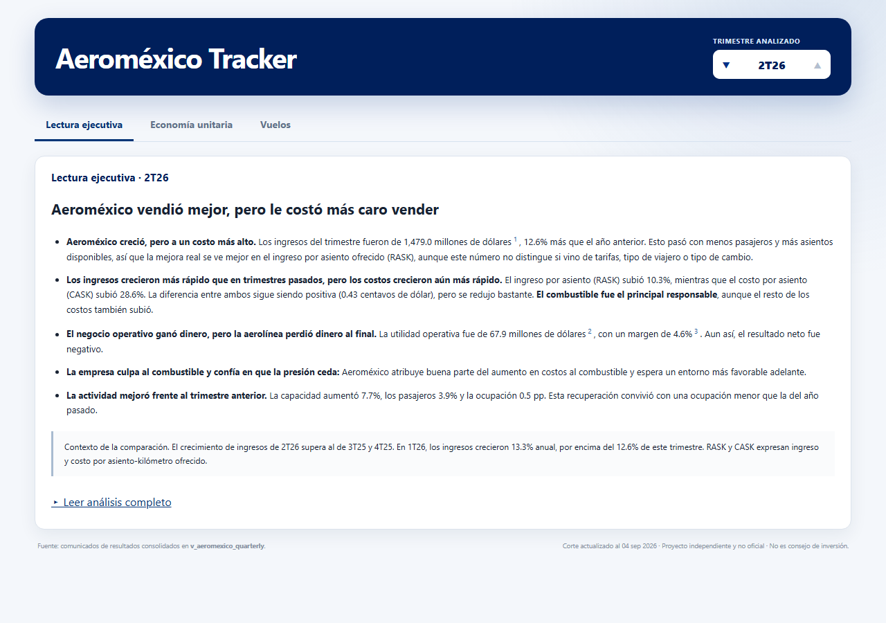

# Aerolíneas MX Tracker

Sistema reproducible de ingesta, consolidación, análisis y visualización de información pública de la **industria aérea mexicana**: **Grupo Aeroméxico S.A.B. de C.V.** (`AERO`, NYSE/BMV; CIK SEC `0001561861`), **Volaris** y **Viva**. "Industria" es la suma de las tres, ~99 % de los pasajeros de aerolíneas mexicanas (AFAC), con razones ponderadas por ASK y nunca promedios simples. El repositorio conserva el nombre `aeromexico-tracker` para no romper la URL de Pages.

El proyecto transforma fuentes regulatorias, operativas y de mercado en una lectura trimestral de negocio. Conserva los datos crudos con hash, separa cifras reportadas de derivadas, explicita faltantes y nunca rellena una ausencia como cero. Es un proyecto independiente de portafolio; **no es oficial ni constituye consejo de inversión**.

## Dashboard

El dashboard publicado presenta tres vistas integradas: Lectura ejecutiva, Economía unitaria y Vuelos, construidas como una página real en `web/` (Vite + TypeScript) y servidas por GitHub Pages. Desde el Dashboard v2 (30 sep 2026), cada tarjeta tiene un selector de aerolínea: Industria, Aeroméxico, Volaris o Viva. Las fases están documentadas en `docs/etapas/dashboard-v2-*.md`.

[Repositorio público en GitHub](https://github.com/salvamalfa/aeromexico-tracker)

**Dashboard público:** <https://salvamalfa.github.io/aeromexico-tracker/>

La autorización permanente de [`AGENTS.md`](AGENTS.md) permite a los agentes
publicar de principio a fin los cambios rutinarios que el dueño solicite,
incluidos PR, merge y despliegue en Pages, sin pedir permiso para cada paso.
Si el cambio afecta al dashboard público y usa datos y análisis ya aprobados,
se publica mediante el gate:

```
uv run python -m src.publish --record analysis_runs/drafts/<periodo>/<version>.json --out site/
uv run python -m src.publish.verify site/
```

Ver `src/publish/README.md` y `REPO_MAP.md` ("Publicación en GitHub Pages") para el flujo completo. El pipeline y dashboard estático usan Python **3.13** y no requieren secretos. El backend de chat es un extra opcional; solo su modo OpenAI lee `OPENAI_API_KEY` desde el entorno privado del servidor.

Para trabajar desde un clon local o con agentes de nube, consulta
[`AGENTS.md`](AGENTS.md) y la [guía de desarrollo desde GitHub](docs/cloud-development.md).
Cambios recientes: [`CHANGELOG.md`](CHANGELOG.md). Lo que sigue:
[`ROADMAP.md`](ROADMAP.md). Mapa del árbol: [`REPO_MAP.md`](REPO_MAP.md).



Para recorrer el argumento completo, consulta [el recorrido narrado](docs/dashboard-recorrido.md).

## Estado

**Analysis Agent:** Etapas 12–14 aceptadas. La [Etapa 15](docs/archivo/etapas/etapa-15-reporte.md)
está implementada y pendiente de revisión humana: [cálculos, puentes y fuentes](prototypes/etapa-15/quantitative_review.html).
El motor utiliza evidencia congelada de 2T26 y conserva las diferencias de alcance pendientes.
El expediente aprobado de 2T26 sí está publicado en el dashboard público (pestaña Lectura
ejecutiva y `data/v1/analysis/2026Q2.json`); lo que sigue pendiente es la redacción y
publicación de análisis de trimestres posteriores.

Las **Etapas 0 a 10 están completas**.

Conteos de tablas Gold y pruebas cambian con cada etapa; la cuenta vigente y
el comando para reproducirla están en [`REPO_MAP.md`](REPO_MAP.md), no aquí.

- Operación offline: el dashboard solo lee Parquet local mediante DuckDB en memoria.

## Hallazgos principales

- Aeroméxico cerró `2026Q2` con ingreso total de **US$1,479 millones**, margen EBITDAR ajustado de **17.9%**, factor de ocupación de **84.9%** y spread unitario RASK−CASK de **0.43 centavos por ASK-km**.
- Entre `2026Q1` y `2026Q2`, el spread cayó **0.68 centavos**: precio aportó `+0.25`, combustible `−1.04` y el residual estructural `+0.11`; FX no pudo aislarse y no se estimó.
- En junio de 2026, la participación total AFAC fue **19.1%** para Aeroméxico frente a **26.2%** para Volaris.
- El forecast SARIMA publicado superó al naive estacional: sMAPE de test **2.50%** frente a **3.36%**, con bandas de 80% y 95% siempre visibles.
- Hay **23 anomalías** abiertas para investigación. No se presentan como errores confirmados.

## Ejecutar localmente

Requisitos: Git, `uv` y `just`.

```powershell
Copy-Item .env.example .env
# Completar SEC_USER_AGENT con un correo real y monitoreado.
just setup
just test
uv run python -m src.web_export --out web/public/data/v1 --allow-missing-analysis
cd web && npm ci && npm run dev
```

`npm run dev` imprime la URL local (`http://127.0.0.1:5173/` por defecto). No necesita internet para consultar las tablas ya construidas. Ver `web/README.md` para el detalle completo (build, preview, pruebas).

| Comando | Propósito |
|---|---|
| `just setup` | Instala el entorno bloqueado y Chromium. |
| `just ingest` | Ejecuta las ingestas registradas que usan red. |
| `just parse` | Reconstruye silver desde bronze inmutable. |
| `just transform` | Construye gold desde silver. |
| `just rebuild` | Reconstrucción completa offline desde bronze. |
| `just test` | Ejecuta la suite. |
| `just dashboard-validate` | Ejecuta los 15 controles de Etapa 10 y los 18 controles de regresión del dashboard. |

## Arquitectura

```text
fuentes públicas
      │
      ▼
data/bronze/     descargas inmutables + SHA-256; no se versionan
      │
      ▼
data/silver/     tablas fieles a cada fuente; no se versionan
      │
      ▼
data/gold/       43 Parquet consolidados y versionados
      │
      ├── data/warehouse.duckdb   vistas analíticas locales
      ├── src/analytics/          estudios y modelos precomputados
      └── src/dashboard/ + src/web_export/   payloads de contrato para web/
            │
            ▼
      web/ (Vite + TS)  ──build──▶  src.publish  ──▶  site/  ──▶  pages.yml (GitHub Pages)
```

Ver [`REPO_MAP.md`](REPO_MAP.md) para el detalle de qué genera cada módulo y
cómo se ensambla `web/` y se publica en `site/`.

Las tablas gold sí se versionan porque son los extractos públicos y compactos que consume el deploy. Bronze y silver siguen fuera de Git. Los hashes, URL y metadata de cada descarga viven en `data/bronze/_manifest.jsonl`; los cambios de contenido se registran en `_restatements.jsonl`.

## Datos y documentación

El Analysis Agent tiene una [lectura de 2T26 auditada para revisión local](prototypes/etapa-17/audited_analysis.html),
una [skill del proyecto](.agents/skills/aeromexico-tracker-analysis/SKILL.md) y
[comandos de autoría](docs/analysis-agent/analista-v1.md). Etapa 17 pendiente de
aceptación; el análisis está validado, pero todavía no aprobado ni integrado al dashboard.

- [Diccionario de tablas y columnas](docs/diccionario-datos.md)
- [Diccionario de conceptos XBRL](docs/diccionario-conceptos-xbrl.md)
- [Hallazgos analíticos](docs/analytics/hallazgos.md)
- [Reportes de etapa vigentes](docs/etapas/) (histórico 0–18 en `docs/archivo/etapas/`)
- [Plan original (histórico)](docs/archivo/plan-original/README.md)

Fuentes principales: SEC EDGAR, BMV XBRL, AFAC, BTS T-100, Banxico, EIA, datos públicos de mercado, reportes de aerolíneas, grupos aeroportuarios y fuentes regulatorias abiertas. Las limitaciones y bloqueos de cada fuente están documentados en los reportes de etapa.

## Actualización

`.github/workflows/refresh.yml` se ejecuta trimestralmente y también de forma manual. Solo monitorea frescura y valida/confirma (commit) el gold ya reconstruido en el runner — no publica el sitio: eso es `.github/workflows/pages.yml`, sobre `site/`. Corre la suite completa y `src.dashboard.validate_stage8` (definición de terminado de Stage 8, sobre el gold público versionado); si algo falla abre un issue y no hace commit. También revisa la fecha de AFAC y abre un recordatorio cuando la fuente manual rebasa 62 días.

Por la decisión explícita de **no versionar bronze**, una reconstrucción con nuevas descargas sigue ejecutándose localmente, donde existen los crudos. El workflow remoto valida y confirma (commit) el gold ya reconstruido; no finge poder recrear fuentes manuales ausentes ni publica el sitio.

## Chat analítico

El chat consulta el snapshot público con una capa semántica versionada; no abre el warehouse ni convierte ausencias en cero. El servicio usa un proveedor simulado por defecto. La integración real con Agents API ya se verificó dentro de la comparación autorizada; el modelo del dashboard todavía no está elegido. La [documentación del chat](docs/chat/README.md) incluye instalación, operación y holdout, y la [validación real](docs/etapas/airline-tracker-validacion-real-20261004.md) registra resultados y límites. H4 requiere completar y revisar la comparación; H5 requiere un servidor persistente con HTTPS. El chat público permanece desactivado.
