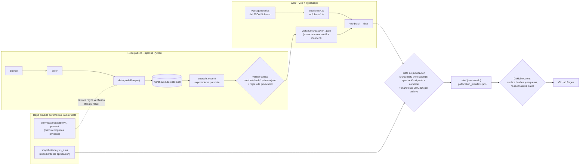

# Auditoría de arquitectura y plan de evolución · 2026-09-26

Estado: **propuesta para decisión del dueño**. Es un documento de solo lectura
del estado actual. No modifica código, datos, aprobaciones ni publicación.

Alcance: repositorio público `aeromexico-tracker` (HEAD `2ca31b2`, rama
`claude/aerodata-box-international-7en30g`) y repositorio privado
`aeromexico-tracker-data` (HEAD `aad7918`). Las mediciones se hicieron en el
entorno de nube con los datos privados restaurados (4 CPU, 15 GB RAM) y, para
comparar, en un clon local del repositorio público sin datos ignorados.

---

## 1. Resumen ejecutivo

- **Diagnóstico central:** el problema no es "Python genera HTML", sino *cómo*: el
  dashboard integrado se compone en 3 capas de mutación de texto (f-strings →
  `str.replace` sobre anclas → cirugía DOM con BeautifulSoup en `reader_ui.refine`)
  y produce un único archivo de 7.2 MB que hay que regenerar completo por cada cambio.
- **67 % del HTML público es Plotly completo** (4.85 MB de 7.23 MB); 30 % es el payload
  de Vuelos embebido (2.16 MB, de ellos 0.55 MB de geometría mundial). El código propio
  de la app pesa 0.06 MB.
- Plotly completo aparece **8 veces** en el árbol (≈39 MB); `static/aeromexico_tracker.html`
  es una copia byte a byte de `prototypes/etapa-11/resumen_ejecutivo.html`.
- **Deriva observada:** en el HEAD auditado el artefacto integrado ya no coincide con su
  generador (la prueba de igualdad falla), porque el marcado del panel de Vuelos está
  **duplicado** en dos funciones Python y regenerar el integrado exige el expediente privado.
- **Pruebas:** 576 pruebas; ≈8 min locales. Un solo cálculo (`build_flight_payload`, 10.5 s,
  90 % en 2,121 `merge` de pandas dentro de un bucle) se repite en ≈20 pruebas: ≈3.5 min.
- **En un clon público fallan 76 pruebas (47 fallas + 29 errores)**, no se omiten. Por eso el
  único workflow del repo público (`refresh.yml`) no puede pasar, y no hay CI en PRs.
- **Git:** 173 MB `.git`; 94 MB son dos versiones de `bridge_record_lineage.parquet`
  (61.8 MB, cerca del límite de 100 MB de GitHub) y 37 MB son versiones de HTML generados.
- **Hosting:** Streamlit Community Cloud instala todo el entorno científico solo para
  mostrar un `iframe` de un HTML estático. No hay servidor que justificar.
- **Recomendación:** Opción **B mínima**: front-end **Vite + TypeScript sin framework de UI**,
  alimentado por **contratos JSON versionados** que exporta el pipeline Python, construido a
  un bundle estático y publicado en **GitHub Pages** detrás del mismo gate de aprobación,
  ahora con manifiesto SHA-256 por archivo. Se llega por pasos (A → D → B), sin romper el sitio.
- Descartar Streamlit como front-end (C) y Astro por ahora (no hay contenido editorial
  multipágina que lo justifique; se puede reconsiderar).
- **Ganancias esperadas (estimadas):** carga inicial de 7.2 MB (1.84 MB gzip) a ≈2 MB
  (≈0.6 MB gzip); suite rápida de CI < 90 s sin datos privados; cambios de UI que tocan
  1–2 archivos en vez de 4–6 y que no reescriben 7 MB en git; historia de git estable.
- **Quick wins (1–2 sesiones):** fixture de sesión + vectorizar `capacity_metrics`,
  marcadores `local_data`/`slow`, comparar hashes en vez de strings de 7 MB, CI rápido en PRs,
  `justfile` multiplataforma, eliminar la copia duplicada `static/` ⇄ `prototypes/`.

---

## 2. Diagnóstico con evidencia

### 2.1 Inventario

| Área (archivos versionados) | Archivos | Bytes | Observación |
|---|---:|---:|---|
| `src/` | 211 | 2.9 MB | 34,896 líneas Python en 190 módulos |
| `tests/` | 89 | 5.5 MB | 66 archivos `test_*.py`, 9,398 líneas, 576 pruebas; 5 MB de fixtures |
| `docs/` | 244 | 15.5 MB | 109 `.md` (18,638 líneas); 49 reportes de etapa (6,751 líneas) |
| `prototypes/` | 15 | 46.7 MB | 8 archivos embeben Plotly completo |
| `static/` | 1 | 7.2 MB | copia idéntica de `prototypes/etapa-11/resumen_ejecutivo.html` |
| `data/` (Gold + manifiestos + referencias) | 61 | 96.3 MB | 48 Parquet Gold locales, 44 versionados |

Mapa de paquetes (`src/`, líneas Python):

| Paquete | Módulos | Líneas | Papel |
|---|---:|---:|---|
| `ingest` | 39 | 6,770 | descarga Bronze (SEC, BMV, AFAC, BTS, AeroDataBox…) |
| `parse` | 28 | 4,691 | Bronze → Silver |
| `transform` | 24 | 6,907 | Silver → Gold, contratos, linaje, warehouse |
| `analytics` | 26 | 5,435 | estudios, IPF ruta×aerolínea, forecast |
| `dashboard` | 43 | 6,032 | payloads, renderizadores HTML, app Streamlit heredada |
| `analysis_agent` | 18 | 2,810 | evidencia, cálculo, revisión, aprobación, publicación |
| `pipeline` + `common` | 12 | 1,422 | registro y orquestación |

Módulos más grandes: `analytics/international_route_carrier.py` (1,404 líneas),
`dashboard/structure_metadata.py` (957), `transform/stage9_lineage.py` (950),
`transform/validate_stage9.py` (867), `transform/stage9.py` (812),
`parse/afac/monthly_stats.py` (809), `analytics/route_carrier.py` (783),
`transform/stage6_facts.py` (772, líneas de hasta 416 caracteres),
`dashboard/flights.py` (701). JavaScript: `assets/flights.js` 1,104 líneas / 64.7 KB
en un solo IIFE con 47 funciones.

**55 de 261** archivos Python de `src/` y `tests/` se nombran por etapa histórica
(`stage6_facts.py`, `stage9.py`, `close_stage18.py`, `validate_stage10.py`…). El nombre
dice *cuándo* se escribió, no *qué* hace. No existe ningún `README` por paquete.

No hay formateador ni linter configurado (`pyproject.toml` no declara `ruff`/`black`).
Hay estilo comprimido con `;` y líneas de 150–1,320 caracteres en
`analysis_agent/stage18.py`, `reader_ui.py` (línea máxima 1,320), `lifecycle.py`,
`stage14_html.py`, `stage13_report.py` y `dashboard/international_routes.py`.

### 2.2 Peso de git

- `.git` = 173 MB (pack 138.7 MB); 144 commits; clon no superficial.
- Peso en disco por ruta a lo largo de la historia:

| Ruta | Versiones | En disco | Sin comprimir |
|---|---:|---:|---:|
| `data/gold/bridge_record_lineage.parquet` | 2 | **93.9 MB** | 123.5 MB |
| `prototypes/etapa-11/resumen_ejecutivo.html` | 21 | 17.5 MB | 133.5 MB |
| `prototypes/vuelos/vuelos_revision.html` | 15 | 15.1 MB | 104.2 MB |
| `data/gold/fact_route_traffic.parquet` | 2 | 15.1 MB | 25.4 MB |
| `data/gold/fact_route_traffic_summary.parquet` | 2 | 7.7 MB | 16.5 MB |
| `static/aeromexico_tracker.html` | 7 | 2.1 MB | 43.7 MB |

- Total: Parquet 120 MB, HTML 37 MB de 176 MB en disco.
- `bridge_record_lineage.parquet` (413,035 filas, 12 columnas, Snappy, un row group) mide
  61.8 MB; recomprimido con zstd-9 y ordenado baja a **35.9 MB** (medido en scratch).
  `fact_route_traffic` pasa de 18.7 a 12.2 MB. Cada regeneración del linaje añade
  ≈47 MB permanentes al historial.
- El repo privado usa LFS para `snapshot/**` (1.2 GB) y su `.git` local pesa 1.3 GB; es
  correcto que sea así.

### 2.3 Flujo de datos y publicación

```text
fuentes ─► data/bronze (local, 1.4 GB, manifiesto versionado)
        ─► data/silver (local, 17 MB)
        ─► data/gold (48 Parquet; 44 versionados; 4 cubos AeroDataBox ignorados)
        ─► data/warehouse.duckdb (local, 78 MB) ◄─ transform/stage6_warehouse.py
              │  + 16 "route_extensions" cargadas solo si el Parquet existe
              ▼
        dashboard/flights.py::build_flight_payload()   (DuckDB, pandas)
        dashboard/executive_summary.py::build_executive_payload()
              ▼
        dashboard/flights_html.py  (f-string, Plotly inline, JSON inline)
        dashboard/executive_summary_html.py (f-string, Plotly inline)
              ▼
        analysis_agent/stage18.py::consumer_html  (str.replace + BeautifulSoup)
        analysis_agent/reader_ui.py::refine       (cirugía DOM: borra KPIs, mueve secciones,
                                                    inserta el panel de Vuelos y su JSON)
              ▼
        publish(): bloqueo del ledger, verificación de aprobación, SHA-256, intent/published
              ▼
        prototypes/etapa-11/resumen_ejecutivo.html ──(copia manual)──► static/aeromexico_tracker.html
              ▼
        streamlit_app.py → st.iframe(static/…) en Streamlit Community Cloud
```

Puntos relevantes:

1. **El gate de publicación es sólido y hay que conservarlo tal cual en su semántica**:
   `stage18.publish` toma el candado del ledger (`flow.writer`), exige
   `flow.consumer_payload` (aprobación vigente) y `flow.verified_inputs`, rechaza dos
   versiones del mismo periodo, escribe un *intent* direccionado por contenido, reemplaza
   atómicamente, verifica el SHA-256 del archivo escrito y deja un recibo `published`.
   El HTML incluye `analysis-manifest` con `content_hash`, `evidence_fingerprint`,
   `approval_event` y `audit_hash`.
2. **La frontera de privacidad es implícita.** El cubo privado ruta×aerolínea se copia a
   mano de `aeromexico-tracker-data/derived/…` a `data/gold/` (ignorado); el acotamiento a
   Aerovías/Connect vive en constantes (`ESTIMATED_CARRIERS` en `domestic_routes.py` e
   `international_routes.py`) y en la lista de llaves que conserva
   `flights_html.integration_flight_payload`. No hay un esquema que prohíba un campo nuevo.
3. **Degradación silenciosa:** `stage6_warehouse.build_warehouse` carga cada extensión con
   `if path.exists()` y `domestic_routes.py`/`international_routes.py` preguntan a
   `information_schema` si la tabla existe. Un build sin los cubos privados produce un
   dashboard sin estimaciones y sin error.
4. **Regenerar el integrado requiere tres cosas locales**: warehouse reconstruido con los
   cubos privados, expediente `analysis_runs/` y el renderizador. Esto explica por qué el
   21-sep se publicó un *parche de texto* sobre el HTML y por qué el commit `2ca31b2`
   ("Put the network passenger total at the top of the route panel") cambió el renderizador
   y `vuelos_revision.html` pero no el integrado: hoy
   `test_generated_artifact_matches_current_renderer` falla por CSS nuevo
   (`.network-volume[hidden]`) ausente del artefacto publicado.
5. El payload de Vuelos declara `schema_version = "flight_dashboard_payload_v1"` desde su
   origen, aunque su forma cambió muchas veces; no hay archivo de esquema. La forma real se
   define entre `flights.py`, `domestic_routes.py`, `international_routes.py`,
   `flights_html.integration_flight_payload` y lo que lee `flights.js`, con muchos
   `.get(key, default)`.
6. Lógica duplicada: `_capacity_by_direction` de `international_routes.py` declara que
   "refleja" la agregación de capacidad de `domestic_routes.py`; son dos copias.

### 2.4 Front-end

- Renderizado: **f-strings de Python** con HTML inline (`flights_html.py`,
  `executive_summary_html.py`, `stage1x_html.py`), una plantilla HTML real solo en
  `analysis_agent/stage12_template.html`, y **BeautifulSoup** para recomponer. No hay Jinja.
- CSS y JS sí son archivos reales en `src/dashboard/assets/`, pero se incrustan como texto.
  Para el integrado, `flights_html.integrated_flights_css()` implementa **un parser de CSS
  propio** que antepone `#panel-flights` a cada selector.
- **Marcado duplicado**: el mismo bloque de Vuelos existe en `render_flights_panel()`
  (integrado) y en `render_flights_html()` (revisión autónoma). El commit `2ca31b2` tuvo que
  editar ambos con el mismo diff.
- Composición del HTML público (medida):

| Bloque | Tamaño |
|---|---:|
| `<script data-runtime="plotly-local">` (Plotly.js 3.7.0 completo) | 4.85 MB |
| `#flight-dashboard-data` | 2.16 MB |
| ├ `route_networks` (18 trimestres internacionales) | 1.00 MB |
| ├ `route_network.world_geometry` (GeoJSON) | 0.55 MB |
| ├ `domestic_monthly_networks` (5 meses × ≈103 KB) | 0.52 MB |
| └ `quarters` + `monthly_passengers` | 0.08 MB |
| `#dashboard-data` (lectura ejecutiva) | 0.06 MB |
| `flights.js` + CSS + marcado | ≈0.12 MB |
| **Total** | **7.23 MB (1.84 MB gzip)** |

- Trazas usadas: `scatter`, `bar`, `scattergeo`, `choropleth`. Un bundle parcial de Plotly
  con esas cuatro trazas pesa del orden de 1.3–1.6 MB minificado (≈0.45 MB gzip)
  *(estimación; se medirá en la fase 4)*.
- Todo el dataset se descarga aunque el lector vea un solo trimestre.
- `test_generated_artifact_matches_current_renderer` exige `< 7,500,000` bytes: quedan
  268 KB de margen.

### 2.5 Pruebas y ciclo de retroalimentación

Mediciones (subconjuntos, entorno con datos restaurados):

| Prueba / grupo | Tiempo |
|---|---:|
| `test_stage9_lineage::test_materialized_stage9_acceptance_gate_passes` | 85.2 s |
| `test_stage14_evidence` (setup de un fixture) | 37.7 s |
| `test_stage18_integration` (2 pruebas) | 53.3 s |
| `build_flight_payload()` llamado en ≈20 pruebas de `test_flights_*` y `test_stage18_*` | ≈10.5 s c/u ≈ 210 s |
| `test_stage11 …matches_current_renderer` (compara 7 MB) | 15.0 s |
| `test_flights_frontend_interactions` (Playwright, setup) | 13.7 s |
| Recolección (`pytest --collect-only`) | 19.6 s |

- Perfil de `build_flight_payload` (22.6 s bajo cProfile): 20.2 s en
  `domestic_routes.estimated_network`, de ellos 18.4 s en 2,121 llamadas a
  `capacity_metrics`, cada una con un `DataFrame.merge(validate="one_to_one")`. Un solo
  `merge` vectorizado por mes lo reduce a fracciones de segundo.
- Las pruebas no comparten el payload: `tests/test_flights_prototype.py::_payload()` y
  `test_flights_national_quarter_selection.py` lo recalculan en cada prueba. No hay
  `tests/conftest.py`.
- **Clon público sin datos ignorados** (una ejecución completa, 59 s):
  `47 failed, 494 passed, 6 skipped, 29 errors`. Causas: 53 errores
  `Cannot open database …/data/warehouse.duckdb`, más Parquet de Silver/Bronze ausentes.
  Archivos afectados: `test_flights_*` (27), `test_stage11_executive_prototype` (11),
  `test_stage12/14/15` (18), `test_stage18_integration` (3), extensiones de rutas
  (`test_domestic_slots`, `test_aifa_*`, `test_aicm_*`, `test_oma_*`,
  `test_afac_exclusive_domestic`: 10), `test_stage9_*` (4) y otros. Solo 3 archivos usan
  `skip`/`importorskip`.
- **Fallas preexistentes con datos locales** (HEAD `2ca31b2`):
  `test_stage12_diagnosis::test_outputs_match_snapshot_and_are_reproducible` (snapshot
  distinto en el byte 19,490) y `test_stage11 …matches_current_renderer` (deriva del §2.3.4).
- Pytest compara strings de 7 MB con `==`; cuando falla, calcular el diff tarda minutos
  (documentado en `docs/etapas/analysis-agent-portabilidad-publicacion-20260925.md`).
- CI: el repo público solo tiene `.github/workflows/refresh.yml` (trimestral/manual). Ejecuta
  `uv run pytest` completo en un runner sin warehouse, así que **no puede pasar** y abrirá un
  issue `validation-failed` en cada corrida. Además valida (`validate_stage8/10`) la app
  Streamlit heredada que ya no se publica. **No hay CI en pull requests.**
- `justfile` fija `set shell := ["powershell.exe", …]`: en Linux (entornos de nube)
  `just test` no funciona; los agentes usan `uv run` directamente.

### 2.6 Legibilidad para agentes de IA

- **Lectura obligatoria antes de tocar Vuelos:** `CLAUDE.md` + `AGENTS.md` +
  `docs/cloud-development.md` + `README.md` + el traspaso de Vuelos + el documento canónico
  del estimador ≈ **115 KB (≈30k tokens)**, antes de abrir código. Las reglas son de buena
  calidad (significado de datos, aprobación, privacidad); lo que falta es un **mapa
  navegable** y límites por módulo.
- **Contexto para un cambio típico de UI** (p. ej. "mover el total de pasajeros de la red al
  panel lateral", que es exactamente `2ca31b2`): `flights.js` (64.7 KB), `flights.css`
  (23 KB), `flights_html.py` (19 KB, dos copias del marcado), `reader_ui.py` (9 KB) y
  `stage18.py` (9 KB) ≈ 125 KB, más regenerar 2–3 HTML de 7 MB y saber que el integrado
  exige el expediente. Resultado real: se editaron 4 archivos y el integrado quedó desfasado.
- **"Agregar una columna a la tabla de rutas"**: tocar `domestic_routes.py` y/o
  `international_routes.py` (llaves), la lista blanca de `integration_flight_payload`
  (si no, la columna se descarta en silencio), `flights.js`, `flights.css`, y regenerar.
  Nada avisa si se olvida un paso: no hay tipo ni esquema compartido Python↔JS.
- **"Agregar un mes de datos"**: flujo privado (workflow AeroDataBox → `derived/` en el repo
  privado) → copia manual a `data/gold/` → `stage6_warehouse` → `build_flights` →
  `stage18 publish` con expediente → copia a `static/` → commit de dos HTML de 7 MB. Siete
  pasos manuales sin un comando único ni verificación de que el mes llegó al HTML.
- **Documentación duplicada o desactualizada**:
  - `README.md` dice "334 pruebas", "31 tablas Gold", "11/11 vistas" y describe
    `src/dashboard/` como "Streamlit + Plotly + ECharts"; hoy son 576 pruebas, 48 Parquet
    Gold y una sola página HTML en un iframe. `docs/cloud-development.md` dice 429 pruebas.
  - Tres documentos sobre el estimador: `estimacion-pasajeros-ruta-aerolinea.md` (85.6 KB,
    canónico), `estimador-ruta-aerolinea.md` (27 KB) y `pasajeros-por-ruta-y-aerolinea.md`
    (21 KB). Los dos últimos ya se declaran "reporte de etapa, no especificación": su lugar
    es `docs/etapas/`.
  - `docs/plan/` (26 archivos) describe etapas 0–17 ya cerradas; no hay una vista de "cómo
    funciona hoy" separada de "cómo llegamos".
- **Código heredado vivo**: la app Streamlit de 11 páginas (`src/dashboard/app.py`,
  `navigation.py`, `pages/`, `components/`, `data.py`, `structure_*`, `validate_stage8/10`:
  ≈3,240 líneas) no se modifica desde el 2026-09-01 y no es lo que se publica, pero sigue en
  pruebas y en `refresh.yml`. Un agente no puede saber, sin leer historia, cuál de los dos
  dashboards es el real.

### 2.7 Hosting actual

- Streamlit Community Cloud sirve `streamlit_app.py`, que solo hace
  `st.iframe(static/aeromexico_tracker.html)` (`docs/deploy-streamlit.md`). Para eso instala
  todas las dependencias principales de `pyproject.toml` (duckdb, pandas, polars, pyarrow,
  playwright, pdfplumber, yfinance, streamlit-echarts…). Community Cloud duerme apps
  inactivas y el arranque en frío es lento; el contenido es 100 % estático.
- No hay configuración de GitHub Pages. El repo público ya es público, así que Pages no
  añade exposición: lo que está en `static/` ya es descargable desde GitHub.

---

## 3. Evaluación de opciones

Escala: ++ muy bueno, + bueno, 0 neutro, − malo, −− muy malo.

| Criterio | A. Python reestructurado (plantillas + JSON separado) | **B. Vite + TypeScript (sin framework UI) + JSON** | C. Streamlit | D. HTML/CSS/JS con ES modules, sin build |
|---|---|---|---|---|
| Legibilidad para IA | + archivos reales, pero la UI sigue repartida entre Python y JS | **++** tipos generados del esquema: el compilador detecta llaves faltantes; un módulo por componente | 0 todo Python, pero la UI actual (mapas, selectores, paneles) tendría que reescribirse con componentes limitados o HTML crudo | + módulos pequeños; sin tipos (salvo JSDoc + `tsc --checkJs`) |
| Velocidad de cambio | + | **++** servidor de desarrollo con recarga; cambiar UI no regenera datos | − cada interacción es un rerun del servidor; difícil igualar el diseño actual | + recarga manual; sin bundling |
| Peso y carga | + si se separa JSON y se usa Plotly parcial | **++** Plotly parcial, *code splitting*, carga perezosa por periodo, hashes de caché | −− servidor Python, websockets, arranque en frío | + requiere vender un Plotly parcial preconstruido |
| Pruebas | + | **++** Vitest para funciones puras + Playwright contra `dist/` con datos sintéticos, sin warehouse | 0 `AppTest` limitado; visual difícil | + Playwright igual que B |
| Hosting (costo/complejidad) | ++ estático | **++** estático en Pages, gratis | − servidor gestionado; sin control de caché ni dominio fácil | ++ estático |
| Gate de aprobación y hashes | + igual que hoy | **++** bundle determinista + manifiesto SHA-256 por archivo | −− la página se genera en tiempo de ejecución: no hay artefacto aprobado que firmar; tienta a leer Parquet privados en el servidor | ++ |
| Riesgo/esfuerzo de migración | bajo, 3–4 sesiones | medio, 8–12 sesiones (incluye A y D como pasos) | alto, reescritura total | bajo-medio, 5–7 sesiones |
| Toolchain adicional | ninguna | Node 22 (ya instalado en el entorno de nube: v22.22.2) + `package.json` bloqueado | ninguna | ninguna (salvo el bundle de Plotly) |

**Veredicto.**

- **C (Streamlit) se descarta.** La app actual no usa ninguna capacidad de servidor; C
  añadiría un proceso que lee datos en tiempo de ejecución, rompe la noción de "artefacto
  aprobado con hash" y crea el riesgo de exponer Parquet privados si alguien los conecta.
  El README actual ya muestra el costo: se instala medio ecosistema científico para un iframe.
- **A** es necesario pero insuficiente: saca el HTML de los f-strings y los datos del HTML,
  pero deja el contrato Python↔JS sin tipos, que es donde hoy se rompen los cambios.
- **D** es la base correcta de organización (módulos ES, datos por `fetch`), pero sin tipos
  el agente sigue sin retroalimentación cuando cambia la forma del payload.
- **Recomendación: B mínima**, alcanzada por la ruta A → D → B: *Vite + TypeScript estricto
  sin React/Vue*, Plotly parcial, datos en JSON validados por **JSON Schema** que se
  convierten en tipos TS. Es la opción que más acorta la distancia entre "cambio en Python"
  y "error visible" para un agente, conserva un artefacto estático firmable y se hospeda
  gratis en GitHub Pages.
- **Astro** queda como opción futura si el sitio pasa a tener varias páginas editoriales
  (p. ej. un archivo de análisis trimestrales). Hoy es una sola página interactiva: Astro no
  añade nada que Vite no dé y sí añade conceptos (islas, colecciones).
- **Parquet en el navegador** (duckdb-wasm / parquet-wasm) no conviene: varios MB de runtime
  para servir decenas de KB por periodo. JSON por periodo, comprimido por Pages, basta.

---

## 4. Arquitectura objetivo

### 4.1 Diagrama



### 4.2 Decisiones de diseño

1. **Contratos de datos como fuente de verdad del front-end.**
   `contracts/web/` contiene un JSON Schema por archivo publicado
   (`flights.quarters.schema.json`, `flights.network.schema.json`,
   `executive.schema.json`, `analysis.schema.json`, `manifest.schema.json`) con
   `additionalProperties: false` y `schema_version` explícito (`v2`). Python valida al
   exportar; `web/` genera tipos con `json-schema-to-typescript`; una prueba verifica que los
   tipos generados están al día. Agregar una columna = editar el esquema, el exportador y la
   vista; el compilador y el validador señalan lo que falte.
2. **Frontera de privacidad declarada, no implícita.** `contracts/web/privacy.yaml` fija:
   aerolíneas permitidas en celdas estimadas (`AEROMEXICO`, `AEROMEXICO_CONNECT`), campos
   prohibidos (matrícula, número de vuelo, hora, modelo por ruta, `source_file` de
   proveedores pagados) y tamaño máximo por archivo. Una prueba recorre `web/public/data/` y
   `site/` y falla si aparece algo fuera de la lista. Los cubos completos siguen solo en el
   repo privado.
3. **Datos divididos por periodo y cargados bajo demanda.** `data/v2/flights/quarters.json`
   (≈80 KB), `data/v2/flights/international/2026Q2.json`, `data/v2/flights/domestic/2026M06.json`,
   `data/v2/geo/world.topo.json` (TopoJSON, ≈285 KB antes de cuantizar). La carga inicial solo
   pide el periodo por defecto.
4. **Una sola implementación de cada vista.** La revisión autónoma de Vuelos y el integrado
   usan el mismo módulo (`web/src/views/flights/`), con una bandera de modo. Se elimina el
   parser de CSS: el CSS vive en archivos por vista con *scoping* por clase raíz o CSS nesting.
5. **El gate de publicación no cambia de dueño ni de semántica**: sigue siendo local o de un
   agente autorizado con el expediente. Cambia el *objeto firmado*: de un HTML de 7 MB a un
   directorio `site/` con `publication_manifest.json` que lista SHA-256 y tamaño de cada
   archivo, la versión de cada contrato, el commit de código y las entradas del
   `analysis-manifest` actual (`period_id`, `version`, `content_hash`,
   `evidence_fingerprint`, `approval_event`, `audit_hash`). El recibo `intent/published` en
   `analysis_runs/publications/` pasa a hashear el manifiesto (hash de hashes).
6. **CI verifica, no publica contenido nuevo.** El workflow de Pages solo despliega `site/`
   tal como está en `master`, después de comprobar manifiesto, esquemas y reglas de
   privacidad. No reconstruye datos ni toca aprobaciones.
7. **Los fallos de insumos son ruidosos.** El exportador recibe una lista declarada de
   insumos requeridos por vista (`config/web_inputs.yaml`); si falta un cubo privado, falla
   con un mensaje que nombra el archivo y cómo restaurarlo, en vez de omitir la sección.

### 4.3 Navegación del repositorio para un agente

Estructura objetivo (solo lo nuevo o renombrado):

```text
REPO_MAP.md                    # ≤150 líneas: qué vive dónde, comandos, flujo de un cambio típico
contracts/
  web/*.schema.json            # contratos publicados (fuente de tipos TS)
  web/privacy.yaml             # frontera pública/privada
config/web_inputs.yaml         # insumos requeridos por vista
src/
  ingest/ parse/ transform/ analytics/   # cada uno con README.md (≤60 líneas)
  web_export/                  # antes: dashboard/flights.py, domestic_routes.py, …
    README.md  flights.py  executive.py  networks/{domestic,international,capacity}.py
  publish/                     # antes: analysis_agent/stage18.py (+ reader_ui ya no hace falta)
    README.md  gate.py  manifest.py  verify.py
  analysis_agent/              # evidencia, cálculo, revisión, aprobación (sin HTML de consumo)
web/
  README.md  package.json  vite.config.ts  tsconfig.json
  src/main.ts  src/views/{executive,economy,flights}/  src/charts/  src/lib/
  public/data/v2/…            # generado por src/web_export (versionado o no: decisión §7)
  tests/                       # Vitest + Playwright con fixtures sintéticos públicos
site/                          # build aprobado + publication_manifest.json (lo único que sirve Pages)
docs/
  arquitectura/                # cómo funciona hoy
  etapas/                      # historia y decisiones
```

Reglas para agentes (se agregan a `AGENTS.md` y se verifican con pruebas):

- Presupuesto de tamaño: módulo Python ≤ 600 líneas, módulo TS ≤ 400 líneas, CSS por
  vista ≤ 300 líneas; ninguna línea > 120 caracteres (`ruff format`, `prettier`). Una
  prueba `tests/test_repo_budgets.py` lista las excepciones vigentes y solo permite que
  bajen.
- Nombres por función, no por etapa: `stage6_facts.py` → `transform/gold_facts.py`, etc.
  El número de etapa queda en el docstring y en `docs/etapas/`.
- Cada paquete con `README.md` que diga: responsabilidad, entradas, salidas, contrato,
  comando de prueba focalizada.
- `REPO_MAP.md` incluye recetas de 5–8 pasos para los tres cambios típicos (agregar columna,
  mover un elemento de UI, agregar un mes) con los archivos exactos.

---

## 5. Plan de migración por fases

Principios de orden: primero lo que acelera el trabajo sin tocar el sitio; nunca dos
cambios de semántica a la vez; el camino actual (`stage18` → `static/` → Streamlit) sigue
vivo hasta que el nuevo produzca paridad verificada y el dueño apruebe el corte.
Esfuerzo en *sesiones de agente* (≈ una sesión de trabajo enfocada con PR).

### Fase 0 · Quick wins de pruebas y CI (1–2 sesiones, riesgo bajo)

Objetivo: suite local < 4 min, suite de CI < 90 s sin datos privados, fallas legibles.

Tareas:
1. `tests/conftest.py`: marcadores `local_data` (requiere warehouse/Silver/Bronze/expediente),
   `slow` (> 5 s), `browser` (Playwright). Auto-skip con motivo explícito cuando falte
   `data/warehouse.duckdb` o `analysis_runs/`, **salvo** si se pide `--require-local-data`
   (que convierte el skip en falla, para uso local antes de publicar).
2. Fixture `scope="session"` para `build_flight_payload()` y `build_executive_payload()`
   compartida por `tests/test_flights_*.py` y `tests/test_stage18_integration.py`.
3. Vectorizar `src/dashboard/domestic_routes.py::capacity_metrics`: un único `merge` por mes
   entre rutas y `capacity_by_direction`, agregación con `groupby`; mismo resultado exacto
   (prueba de igualdad del payload antes/después). Extraer la agregación compartida con
   `international_routes._capacity_by_direction` a un módulo común.
4. Cambiar las comparaciones de artefactos de 7 MB por SHA-256 + diff acotado de las primeras
   diferencias (`tests/test_stage11_executive_prototype.py:246`,
   `tests/test_flights_prototype.py::test_generated_review_matches_current_renderer`,
   `tests/test_stage12_diagnosis.py`).
5. `.github/workflows/ci.yml` en PRs: `uv sync --locked` + `pytest -m "not local_data"`
   (+ Playwright solo sobre fixtures públicos). Arreglar `refresh.yml` para ejecutar el mismo
   subconjunto y documentar que la validación completa es local.
6. `justfile`: `set windows-shell := ["powershell.exe", …]` y `set shell := ["bash", "-c"]`
   para que funcione en Windows y Linux.
7. Registrar como deuda conocida las dos fallas actuales (`test_stage12_diagnosis` y la deriva
   del integrado) en el reporte de etapa; la regeneración del integrado es publicación y
   requiere instrucción del dueño.

Criterios de salida: `pytest -m "not local_data"` verde en un clon público; suite local
completa < 4 min en el entorno de nube; `build_flight_payload()` < 2 s; payload idéntico
(hash del JSON) antes y después de la vectorización.

### Fase 1 · Higiene del repositorio y documentación (1–2 sesiones, riesgo bajo)

1. `REPO_MAP.md` en la raíz y enlace desde `CLAUDE.md`/`AGENTS.md`; `README.md` por paquete.
2. Corregir cifras desactualizadas de `README.md` y `docs/cloud-development.md`, o
   reemplazarlas por "ver `REPO_MAP.md`" (una sola fuente para conteos).
3. Mover `docs/estimador-ruta-aerolinea.md` y `docs/pasajeros-por-ruta-y-aerolinea.md` a
   `docs/etapas/` (ya se declaran reportes de etapa); dejar `docs/plan/` como histórico con un
   aviso en su `README.md`.
4. `ruff` (format + reglas básicas, línea 100–120) en `pyproject.toml`; aplicar primero a
   `src/analysis_agent/{stage18,reader_ui,lifecycle}.py` y `src/dashboard/international_routes.py`
   en commits de solo formato (sin cambios de comportamiento; la suite lo prueba).
5. `tests/test_repo_budgets.py` con la lista de excepciones actuales de tamaño.
6. Eliminar la duplicación `static/aeromexico_tracker.html` ⇄
   `prototypes/etapa-11/resumen_ejecutivo.html` **en el árbol** sin tocar el contenido
   publicado: `streamlit_app.py` puede leer directamente la salida canónica, o `static/` pasa
   a ser la única salida de `stage18 publish`. Requiere confirmación del dueño porque cambia
   la ruta que sirve el deploy.
7. Decidir el destino de la app Streamlit heredada (≈3,240 líneas; §7). Si se retira, quitar
   `validate_stage8/10` de `refresh.yml` y archivar las pruebas.

Criterios de salida: un agente nuevo encuentra en `REPO_MAP.md` los archivos exactos de los
tres cambios típicos; `ruff format --check` verde en los módulos migrados.

### Fase 2 · Contratos de datos del front-end (2–3 sesiones, riesgo medio)

1. Escribir `contracts/web/*.schema.json` describiendo **el payload actual** (`v1`) tal cual,
   inferido de `integration_flight_payload`, `standalone_flight_payload` y
   `build_executive_payload`. Validar el payload actual contra él en pruebas.
2. `contracts/web/privacy.yaml` + `tests/test_web_privacy.py` (aerolíneas permitidas en
   estimados, campos prohibidos, tamaños).
3. `src/web_export/` con exportadores que escriben `web/public/data/v2/…json` divididos por
   periodo. En esta fase conviven: el HTML actual sigue embebiendo `v1`.
4. `config/web_inputs.yaml` y falla ruidosa si falta un insumo privado (sustituye los
   `if path.exists()` de `stage6_warehouse.py` por una lista declarada de extensiones
   *requeridas para publicar* vs *opcionales para desarrollo*).

Criterios de salida: para cada periodo, `v2` reconstruye exactamente las cifras de `v1`
(prueba de equivalencia campo a campo); las pruebas de privacidad pasan; el exportador falla
con mensaje claro sin los cubos privados.

### Fase 3 · Front-end en archivos reales con ES modules (Opción D; 2–3 sesiones, riesgo medio)

1. `web/index.html` con el marcado de las tres pestañas (copiado del HTML publicado, no de los
   f-strings), `web/src/views/{executive,economy,flights}/*.js` partiendo `flights.js` en
   módulos ≤ 400 líneas (estado, selector de periodo, mapa, tabla de rutas, panel lateral,
   formatos).
2. Una sola implementación del panel de Vuelos para modo integrado y modo revisión.
3. CSS por vista; se elimina `integrated_flights_css()`.
4. Carga de datos por `fetch` desde `data/v2/`.
5. Pruebas de paridad Playwright: para una matriz de periodos y selecciones, las cifras
   visibles (KPIs, filas de la tabla de rutas, totales del panel) del sitio nuevo son iguales
   a las del `static/aeromexico_tracker.html` vigente.

Criterios de salida: paridad 100 % en la matriz; el HTML actual sigue siendo lo publicado.

### Fase 4 · Vite + TypeScript (Opción B; 2–3 sesiones, riesgo medio)

1. `web/package.json` con versiones fijas y `package-lock.json`; `vite`, `typescript`,
   `json-schema-to-typescript`, `vitest`, `@playwright/test`, Plotly parcial
   (`plotly.js/lib/core` + `scatter`, `bar`, `scattergeo`, `choropleth`).
2. Renombrar módulos a `.ts` con `strict: true`; tipos generados desde `contracts/web/`;
   `npm run check` (tsc) en CI.
3. Vitest para funciones puras (agregaciones de meses, formatos, rangos de ocupación).
4. Playwright contra `vite preview` con **fixtures sintéticos públicos** en `web/tests/fixtures/`
   (sin warehouse), para que corra en CI.
5. Medir y registrar: tamaño del bundle, bytes iniciales, tiempo a primer gráfico. Objetivo:
   ≤ 2 MB transferibles sin comprimir en la carga inicial.
6. Opción para revisión offline: `vite-plugin-singlefile` genera un HTML autónomo para
   revisión humana cuando se necesite enviar un archivo.

Criterios de salida: `npm run build` determinista (dos builds → mismos hashes); CI verde;
paridad de la fase 3 sostenida.

### Fase 5 · Gate de publicación sobre `site/` y GitHub Pages (1–2 sesiones, riesgo alto → mitigado)

1. `src/publish/` reemplaza a `stage18.consumer_html`/`reader_ui.refine`: el contenido
   aprobado del Analysis Agent se exporta como `data/v2/analysis/<periodo>.json` (texto,
   citas, diálogos) validado por esquema, solo si `flow.consumer_payload` lo autoriza, bajo el
   mismo `flow.writer`. Se conservan intent/published, reemplazo atómico y verificación de hash.
2. `publication_manifest.json` en `site/` (§4.2.5) y `src/publish/verify.py` reutilizable por CI.
3. `.github/workflows/pages.yml`: en push a `master` que toque `site/`, ejecutar
   `verify.py` y desplegar con `actions/deploy-pages`. Sin secretos, sin datos privados.
4. Periodo de convivencia: Pages y Streamlit sirven lo mismo; se compara el contenido.
5. Corte con aprobación explícita del dueño: `README.md` apunta a Pages; Streamlit queda como
   redirección o se retira (§7).

Criterios de salida: `verify.py` rechaza un `site/` con un byte alterado, un campo no
declarado, una aerolínea fuera de la lista o un `content_hash` sin aprobación vigente
(pruebas negativas); el recibo en `analysis_runs/publications/` referencia el hash del
manifiesto.

### Fase 6 · Peso de git y retiro de artefactos (0.5–1 sesión + decisión del dueño)

1. Sacar `data/gold/bridge_record_lineage.parquet` del árbol público (publicarlo como asset
   de GitHub Release o mantenerlo en el repo privado, con su SHA-256 en un manifiesto
   versionado) o, como mínimo, reescribirlo con zstd ordenado (61.8 → 35.9 MB medido).
2. Retirar de `prototypes/` los HTML sin generador vigente o históricos
   (`etapa-17/propuesta_texto_usuario.html`, `etapa-18/{reader_preview,lectura_negocio_revision,
   resumen_ejecutivo_revision}.html`, `archive/`) hacia una Release o el repo privado, dejando
   enlaces y hashes en `docs/etapas/`.
3. Opcional, destructivo y solo con autorización: `git filter-repo` para purgar versiones
   antiguas de HTML y Parquet (≈130 MB de 173 MB); exige *force push* y reclonar.

Criterios de salida: `.git` de un clon nuevo < 60 MB sin reescritura y < 40 MB con ella;
ningún archivo versionado > 25 MB.

### Resumen de fases

| Fase | Sesiones | Riesgo | El sitio sigue igual | Toca el gate |
|---|---:|---|---|---|
| 0 Pruebas y CI | 1–2 | bajo | sí | no |
| 1 Higiene y docs | 1–2 | bajo | sí | no |
| 2 Contratos de datos | 2–3 | medio | sí | no |
| 3 Front-end modular (D) | 2–3 | medio | sí | no |
| 4 Vite + TS (B) | 2–3 | medio | sí | no |
| 5 Gate sobre `site/` + Pages | 1–2 | alto (mitigado con convivencia) | cambia con aprobación | sí, misma semántica |
| 6 Git y artefactos | 0.5–1 | bajo/alto si se reescribe | sí | no |
| **Total** | **≈10–16** | | | |

---

## 6. Eficiencias fuera del front-end

**Pipeline**
- `stage9` acceptance gate: 85 s con datos completos. Materializar el linaje por tabla
  (particionado por `table_name`) y validar incrementalmente las tablas cambiadas; dejar la
  validación completa como `slow`.
- Reemplazar bucles fila a fila con pandas (`capacity_metrics` es el caso medido) por
  operaciones vectorizadas o SQL en DuckDB; el warehouse ya existe y es más rápido para
  joins/agregaciones.
- Un comando único y verificable para "agregar un mes":
  `python -m src.pipeline.month_refresh 2026M08 --dry-run` que lista insumos privados
  necesarios, verifica sus SHA-256 contra el manifiesto del repo privado, reconstruye
  warehouse, exporta `data/v2` y muestra el diff de cifras. No publica.
- Sincronización privada → pública como script (`restore_snapshot.py --only derived`) en vez de
  copia manual, con verificación de hash.

**Pruebas**
- Tres niveles: `unit` (sin datos, < 60 s, CI en cada PR), `local_data` (requiere snapshot,
  antes de publicar), `slow/browser` (nocturno o manual).
- Fixtures sintéticos públicos pequeños para las pruebas de payload y de UI; los números
  reales se prueban solo en `local_data`.
- `pytest-xdist` para el nivel `local_data` (4 CPU disponibles); primero hay que eliminar
  escrituras compartidas en `prototypes/` durante pruebas.
- Recolección de 19.6 s: evitar imports pesados a nivel de módulo en pruebas (Playwright,
  spaCy, statsforecast) con imports perezosos.

**Documentación**
- Separar "cómo funciona hoy" (`docs/arquitectura/`, `REPO_MAP.md`, READMEs) de "cómo
  llegamos" (`docs/etapas/`, `docs/plan/`). Las cifras vivas (número de pruebas, tablas) no
  se copian a prosa.
- `docs/referencias/*.json` (≈3.5 MB) son salidas de revisión: mover a Release o al repo
  privado si no se consultan.

**Repositorio y CI**
- Formateador y linter (`ruff`, `prettier`) con *pre-commit* opcional; `git diff --check` en CI.
- Acciones fijadas por SHA y versiones alineadas entre repos (el privado usa
  `checkout@v4`/`setup-uv@v6`; el público `checkout@v7`/`setup-uv@v10.0.1`).
- `concurrency` y cachés de `uv` y de navegadores de Playwright en CI.
- `just` multiplataforma (Fase 0).

---

## 7. Riesgos y decisiones que requieren al dueño

| # | Decisión | Opciones | Recomendación |
|---|---|---|---|
| 1 | Aprobar la dirección B (Vite + TS) y la introducción de Node en el repo público | sí / quedarse en D | Sí; D como paso intermedio obligatorio |
| 2 | Hosting final | GitHub Pages / mantener Streamlit / ambos | Pages; Streamlit como redirección 1–2 meses |
| 3 | Regenerar y republicar el integrado para cerrar la deriva actual (`2ca31b2`) | ahora / en la fase 5 | Decisión del dueño: es publicación |
| 4 | Retirar la app Streamlit de 11 páginas heredada y `validate_stage8/10` | retirar / archivar en rama / conservar | Archivar en una etiqueta git y retirar |
| 5 | Versionar `web/public/data/v2/*.json` en git | sí (diffs revisables) / solo dentro de `site/` | Solo en `site/` aprobado; en desarrollo se regenera |
| 6 | Qué se considera "aprobado" en el nuevo modelo | solo el análisis (como hoy) / también datos de Vuelos | Mantener hoy: el análisis requiere aprobación; los datos de Vuelos requieren las reglas de privacidad y la revisión humana ya documentada |
| 7 | Sacar `bridge_record_lineage.parquet` del árbol público | Release / repo privado / zstd en su lugar | Release pública con hash (el linaje no es privado) |
| 8 | Reescribir la historia de git | no / sí con `filter-repo` | Solo si el tamaño de clon molesta; exige coordinación |
| 9 | Retirar prototipos históricos de `prototypes/` | mover a Release / conservar | Mover, dejando hashes en `docs/etapas/` |

Riesgos principales y mitigación:

- **Pérdida de fidelidad visual o numérica en la migración** → pruebas de paridad Playwright
  contra el HTML publicado vigente (fase 3) antes de cualquier corte.
- **Debilitar el gate** → el gate sigue local y con expediente; CI solo verifica. Pruebas
  negativas obligatorias en la fase 5. El manifiesto conserva todos los campos del
  `analysis-manifest` actual.
- **Fuga de datos privados al separar JSON** → los mismos datos ya son extraíbles del HTML
  actual; el cambio real es positivo porque la frontera pasa a esquema + lista de permitidos
  + prueba.
- **Toolchain de Node** → versiones fijas, lockfile, `npm ci`; el entorno de nube ya trae
  Node 22.
- **Trabajo concurrente de otros agentes** → cada fase es un PR aislado; las fases 0–1 no
  tocan comportamiento.
- **Estimaciones de tamaño** (bundle parcial de Plotly, carga inicial) no están medidas aún;
  la fase 4 las mide y, si no se cumplen, se ajusta el alcance (p. ej. separar el mapa en un
  chunk perezoso).
